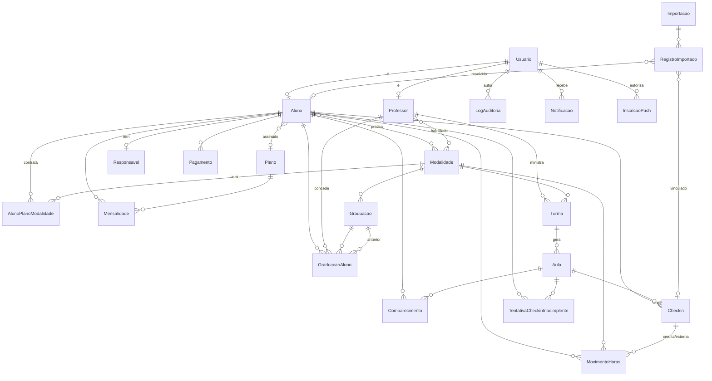

# Modelo de dados — ECVO

Fonte de verdade: `prisma/schema.prisma`. Este documento explica as decisões e relações principais.

## Princípio central: presença e horas

- **Presença não é uma tabela.** Presença ≡ existe um `Checkin` com `status = VALIDO` para o par
  (aluno, aula). Evita estado redundante (RF-025).
- `Checkin.status = PENDENTE_REVISAO` registra tentativa que exige aprovação; não gera presença nem
  movimento de horas até professor/gestor aprovar lançando o check-in como válido.
- **Horas são um livro-razão (ledger) append-only** em `MovimentoHoras`:
  - check-in válido ⇒ um movimento `CREDITO` com `minutos = duração da aula`, ligado ao `checkinId` e à `modalidadeId`;
  - invalidar/excluir o check-in ⇒ um movimento `ESTORNO` com `minutos` negativos e `estornaMovimentoId`
    apontando o crédito — **nunca** se apaga o crédito original (RF-035/RN-005);
  - ajuste manual ⇒ `AJUSTE_MANUAL` (com `autorId` e `motivo`).
  - **Total geral** = `SUM(minutos)` por aluno; **por modalidade** = `SUM(minutos)` filtrado por `modalidadeId`.
- **Sem dupla contagem**: `@@unique([alunoId, aulaId])` em `Checkin` (RF-039).
- **QR global de check-in**: `TokenCheckinAcademia` guarda o único token válido por vez. Ao rotacionar,
  URLs antigas deixam de validar. Tentativas de aluno inadimplente ficam em
  `TentativaCheckinInadimplente`; elas disparam alerta e auditoria, mas não criam `Checkin` nem horas.

## Entidades

Usuário · Aluno · Responsavel · Professor · Modalidade · Turma · Aula · Comparecimento (agendamento de aula) · Checkin ·
TentativaCheckinInadimplente · TokenCheckinAcademia · MovimentoHoras · Graduacao · GraduacaoAluno ·
Exame · InscricaoExame · Plano · AlunoPlanoModalidade · Mensalidade · Pagamento · Importacao ·
RegistroImportado · LogAuditoria · ConfiguracaoAcademia · Notificacao · InscricaoPush.

## Diagrama (ER simplificado)

## Notas

- **Turma** modela tanto a grade recorrente (`diasSemana`/`horaInicio`/`horaFim`) quanto eventos únicos
- **Aluno.diaVencimento** define o dia usado ao gerar mensalidades internas; `Mensalidade.vencimento`
  preserva a data histórica da cobrança gerada.
- **AlunoPlanoModalidade** define quais modalidades do aluno estão cobertas pelo plano mensal interno.
  O plano não restringe modalidades; a seleção acontece no vínculo aluno-plano.
  (`ehEvento = true`, sem dia da semana). **Aula** é a ocorrência datada concreta.
- **Agendamento de aula** é persistido no modelo técnico `Comparecimento`. Pode ficar em `LISTA_ESPERA`
  quando a capacidade da aula foi atingida e a configuração de lista de espera está ativa. Ao cancelar um
  agendamento `CONFIRMADO`, o primeiro registro em lista de espera da aula é promovido para `CONFIRMADO`, com
  auditoria e notificação.
- **ConfiguracaoAcademia** é um singleton (`id = "default"`) com as regras configuráveis: janela de
  agendamento, exigência de agendamento para check-in, política de check-in sem agendamento,
  bloqueio por inadimplência, lista de espera, ranking de horas, notificações e valor base financeiro
  por modalidade.
- **RegistroImportado.valorRepasse** guarda o valor financeiro importado de Wellhub/TotalPass quando a
  planilha traz repasse por check-in; o JSON bruto continua preservado em `dadosBrutos`.
- **Modalidade** pode definir overrides operacionais para janela de agendamento, prazo de
  cancelamento, exigência/política de check-in sem agendamento e lista de espera. Campos nulos herdam a
  regra global de `ConfiguracaoAcademia`.
- **GraduacaoAluno** guarda a graduação concedida e, quando houver, `graduacaoAnteriorId`; isso preserva o
  histórico `anterior -> nova` exigido por RF-042 sem depender do log de auditoria para reconstruir a troca.
- **LogAuditoria** guarda `valorAntigo`/`valorNovo` como JSON, gravado na mesma transação da ação crítica.
- **InscricaoPush** guarda as inscrições Web Push autorizadas por usuário/dispositivo; `Notificacao` continua
  sendo a caixa interna de referência, e o push é um canal adicional quando configurado.
